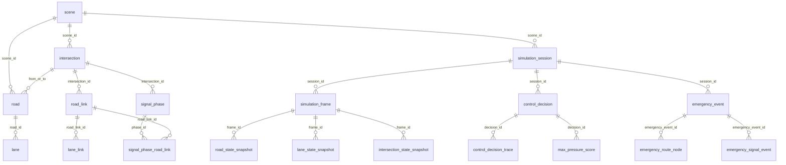

# 数据库结构说明

更新时间：2026-07-11

本文档根据 `backend/src/main/resources/db/migration`、当前后端读取表，以及后端同学提供的《Traffic-Signal-Database-Schema-Design.xlsx》整理。核心迁移脚本已经从旧的 `cityflow_*` 扁平表，调整为按业务实体拆分的标准结构。

## 当前数据库模式

| 场景 | 数据库 | 建表方式 | 说明 |
| --- | --- | --- | --- |
| 默认本地启动 | H2 内存库 | Flyway 自动执行 `db/migration` | 用于本地快速验证，应用重启后数据丢失。 |
| `postgres` profile | PostgreSQL `traffic_signal` | Flyway 关闭，Hibernate 不建表 | 用于连接已有数据库，避免自动改动真实库结构。 |

注意：`postgres` profile 中 `spring.flyway.enabled=false`，`spring.jpa.hibernate.ddl-auto=none`。因此本文档中的 Flyway 结构代表项目内置初始化结构，不一定等同于本机已有 PostgreSQL 的真实结构。

## 实施原则

- 标准核心表采用表格中的实体名称：`scene`、`intersection`、`road`、`lane`、`signal_phase`、`simulation_frame`、`control_decision` 等。
- `dashboard_*`、`analytics_*` 和现有接口使用的 `intersections` 表继续保留，避免影响当前前端页面和已经打通的路口 API。
- 表格中建议为 `jsonb` 或 `jsonb / geometry` 的字段，在当前 Flyway 脚本里使用 `text`，保证 H2 本地环境可以启动；真实 PostgreSQL 落库时可按需要升级为 `jsonb` 或 PostGIS `geometry`。
- 标准实体主键为 `uuid`，由业务代码生成，不在迁移脚本中绑定 H2 专有默认函数。
- 核心关系已声明外键和常用唯一约束，演示表仍保持原有轻量结构。

## 表分组总览

| 业务域 | 表 |
| --- | --- |
| 路网与地图绑定 | `scene`、`intersection`、`road`、`lane`、`road_link`、`lane_link` |
| 信号相位与安全约束 | `signal_phase`、`signal_phase_road_link`、`signal_timing_plan`、`signal_timing_plan_phase`、`safety_constraint`、`phase_transition_rule` |
| 仿真会话与状态快照 | `simulation_session`、`simulation_frame`、`road_state_snapshot`、`lane_state_snapshot`、`intersection_state_snapshot`、`vehicle_state_snapshot` |
| 策略调度与模型审计 | `control_decision`、`control_decision_trace`、`traffic_r_inference_log`、`max_pressure_score`、`strategy_fallback_event`、`safety_constraint_event` |
| 区域、应急、Agent 与运维 | `control_region`、`control_region_intersection`、`emergency_event`、`emergency_route_node`、`emergency_signal_event`、`agent_conversation`、`agent_message`、`agent_tool_call`、`operation_audit_log`、`alert_event`、`service_health_snapshot` |
| 当前保留的兼容/演示表 | `intersections`、`dashboard_*`、`analytics_*` |

## 逻辑关系

## 路网与地图绑定

| 表 | 主键/唯一约束 | 字段 |
| --- | --- | --- |
| `scene` | `id`; `scene_code` 唯一 | `scene_code`、`name`、`source_type`、`cityflow_roadnet_path`、`cityflow_flow_path`、`map_provider`、`coordinate_system` |
| `intersection` | `id`; `(scene_id, cityflow_id)` 唯一 | `scene_id`、`cityflow_id`、`map_intersection_id`、`name`、`type`、`virtual`、`longitude`、`latitude`、`x`、`y` |
| `road` | `id`; `(scene_id, cityflow_id)` 唯一 | `scene_id`、`cityflow_id`、`from_intersection_id`、`to_intersection_id`、`name`、`direction`、`length_m`、`speed_limit`、`lane_count`、`geometry` |
| `lane` | `id`; `(road_id, cityflow_lane_index)` 唯一 | `road_id`、`cityflow_lane_index`、`lane_code`、`direction`、`movement`、`width`、`speed_limit` |
| `road_link` | `id`; `(intersection_id, cityflow_index)` 唯一 | `intersection_id`、`cityflow_index`、`from_road_id`、`to_road_id`、`movement_type` |
| `lane_link` | `id`; `(road_link_id, start_lane_id, end_lane_id)` 唯一 | `road_link_id`、`start_lane_id`、`end_lane_id`、`geometry` |

## 信号相位与安全约束

| 表 | 主键/唯一约束 | 字段 |
| --- | --- | --- |
| `signal_phase` | `id`; `(intersection_id, phase_index)` 唯一 | `intersection_id`、`phase_index`、`phase_code`、`phase_name`、`phase_type`、`default_green_sec`、`yellow_sec`、`all_red_sec` |
| `signal_phase_road_link` | `(phase_id, road_link_id)` 复合主键 | `phase_id`、`road_link_id` |
| `signal_timing_plan` | `id`; `(intersection_id, plan_code)` 唯一 | `intersection_id`、`plan_code`、`name`、`source`、`cycle_sec`、`offset_sec`、`status` |
| `signal_timing_plan_phase` | `id`; `(plan_id, sequence_no)`、`(plan_id, phase_id)` 唯一 | `plan_id`、`phase_id`、`sequence_no`、`green_sec` |
| `safety_constraint` | `id` | `intersection_id`、`constraint_type`、`min_value`、`max_value`、`config_payload` |
| `phase_transition_rule` | `id`; `(intersection_id, from_phase_id, to_phase_id)` 唯一 | `intersection_id`、`from_phase_id`、`to_phase_id`、`allowed`、`transition_yellow_sec`、`transition_all_red_sec` |

## 仿真会话与状态快照

| 表 | 主键/唯一约束 | 字段 |
| --- | --- | --- |
| `simulation_session` | `id`; `sid` 唯一 | `sid`、`scene_id`、`controller_type`、`speed`、`status` |
| `simulation_frame` | `id`; `(session_id, seq)` 唯一 | `session_id`、`seq`、`sim_time`、`vehicle_count`、`queue_count`、`avg_speed`、`avg_wait`、`throughput` |
| `road_state_snapshot` | `id`; `(frame_id, road_id)` 唯一 | `frame_id`、`road_id`、`vehicle_count`、`queue_count`、`avg_speed`、`level` |
| `lane_state_snapshot` | `id`; `(frame_id, lane_id)` 唯一 | `frame_id`、`lane_id`、`queue_len`、`vehicle_count`、`avg_wait_time`、`cell_1`、`cell_2`、`cell_3`、`cell_4` |
| `intersection_state_snapshot` | `id`; `(frame_id, intersection_id)` 唯一 | `frame_id`、`intersection_id`、`queue_count`、`avg_wait`、`level`、`current_phase_id` |
| `vehicle_state_snapshot` | `id`; `(frame_id, vehicle_id)` 唯一 | `frame_id`、`vehicle_id`、`road_id`、`lane_id`、`x`、`y`、`angle`、`speed`、`vehicle_type` |

## 策略调度与模型审计

| 表 | 主键/唯一约束 | 字段 |
| --- | --- | --- |
| `control_decision` | `id` | `session_id`、`intersection_id`、`sim_time`、`controller_type`、`requested_phase_id`、`final_phase_id`、`duration_sec`、`status`、`reason` |
| `control_decision_trace` | `id` | `decision_id`、`stage`、`input_payload`、`output_payload`、`message` |
| `traffic_r_inference_log` | `id` | `session_id`、`sim_time`、`request_payload`、`prompt_text`、`raw_output`、`parsed_phase_code`、`valid`、`latency_ms`、`error_message` |
| `max_pressure_score` | `id`; `(decision_id, phase_id)` 唯一 | `decision_id`、`phase_id`、`pressure_score`、`detail_payload` |
| `strategy_fallback_event` | `id` | `session_id`、`intersection_id`、`from_strategy`、`to_strategy`、`reason`、`sim_time` |
| `safety_constraint_event` | `id` | `decision_id`、`constraint_type`、`action`、`before_phase_id`、`after_phase_id`、`reason` |

## 区域、应急、Agent 与运维

| 表 | 主键/唯一约束 | 字段 |
| --- | --- | --- |
| `control_region` | `id`; `(scene_id, region_code)` 唯一 | `scene_id`、`region_code`、`name`、`controller_type`、`region_type` |
| `control_region_intersection` | `(region_id, intersection_id)` 复合主键 | `region_id`、`intersection_id`、`role` |
| `emergency_event` | `id`; `event_code` 唯一 | `session_id`、`event_code`、`vehicle_id`、`vehicle_type`、`priority`、`status`、`start_coord`、`end_coord` |
| `emergency_route_node` | `id`; `(emergency_event_id, sequence_no)` 唯一 | `emergency_event_id`、`sequence_no`、`intersection_id`、`road_id`、`planned_arrival_time`、`actual_arrival_time` |
| `emergency_signal_event` | `id` | `emergency_event_id`、`intersection_id`、`sim_time`、`action_type`、`phase_id_before`、`phase_id_after`、`reason` |
| `agent_conversation` | `id` | `user_id`、`session_id`、`title` |
| `agent_message` | `id` | `conversation_id`、`role`、`content` |
| `agent_tool_call` | `id` | `message_id`、`tool_name`、`arguments_payload`、`result_payload`、`status`、`latency_ms` |
| `operation_audit_log` | `id` | `actor_type`、`actor_id`、`operation_type`、`target_type`、`target_id`、`request_payload`、`result_status` |
| `alert_event` | `id` | `session_id`、`alert_type`、`level`、`target_type`、`target_id`、`title`、`description`、`status` |
| `service_health_snapshot` | `id` | `service_name`、`status`、`latency_ms`、`detail_payload`、`checked_at` |

## 保留表

### `intersections`

当前路口基础 API 仍读取和更新 `intersections` 表：

- `GET /api/v1/intersections`
- `GET /api/v1/intersections/{code}`
- `PATCH /api/v1/intersections/{code}/status`

字段保持不变：`id`、`code`、`name`、`district`、`longitude`、`latitude`、`status`、`metadata`、`created_at`、`updated_at`。后续如果要完全切到标准 `intersection` 表，需要同步改 Controller、Service、Repository、DTO 和前端调用。

### `dashboard_*`

`dashboard_intersection`、`dashboard_road`、`dashboard_vehicle`、`dashboard_emergency_vehicle`、`dashboard_emergency_route`、`dashboard_alert`、`dashboard_statistics`、`dashboard_compare_metric`、`dashboard_congestion_trend`、`dashboard_assistant_reply` 继续作为驾驶舱演示数据表保留。

### `analytics_*`

`analytics_overview`、`analytics_metric`、`analytics_status_bucket`、`analytics_daily_point`、`analytics_hourly_point`、`analytics_building_summary`、`analytics_heatmap_cell`、`analytics_composition_item`、`analytics_scatter_point`、`analytics_monitoring_record`、`analytics_toast` 继续作为数据分析页演示数据表保留。

## 当前后端实际访问表

| 代码位置 | 表 |
| --- | --- |
| `IntersectionRepository` | `intersections` |
| `DashboardRepository` | `dashboard_intersection`、`dashboard_road`、`dashboard_vehicle`、`dashboard_emergency_vehicle`、`dashboard_emergency_route`、`dashboard_alert`、`dashboard_statistics`、`dashboard_compare_metric`、`dashboard_congestion_trend`、`dashboard_assistant_reply` |
| `DataAnalysisRepository` | `analytics_overview`、`analytics_metric`、`analytics_status_bucket`、`analytics_daily_point`、`analytics_hourly_point`、`analytics_building_summary`、`analytics_heatmap_cell`、`analytics_composition_item`、`analytics_scatter_point`、`analytics_monitoring_record`、`analytics_toast` |
| `DatabaseStatusService` | 标准核心表、`intersections`、`dashboard_intersection`、`analytics_overview` |

## 后续注意事项

- 如果要让 PostgreSQL 自动执行这些迁移，需要先确认 `postgres` profile 的 Flyway 策略，并把 `text` 形式的 JSON/几何字段升级为真实 `jsonb` 或 PostGIS 类型。
- 当前标准表仅完成结构定义，业务读写仍主要集中在保留表和外部 CityFlow 服务；后续接入落库时需要新增 Repository/Service。
- `intersections` 与标准 `intersection` 暂时并存。前者服务当前 API，后者服务规范化路网模型。
