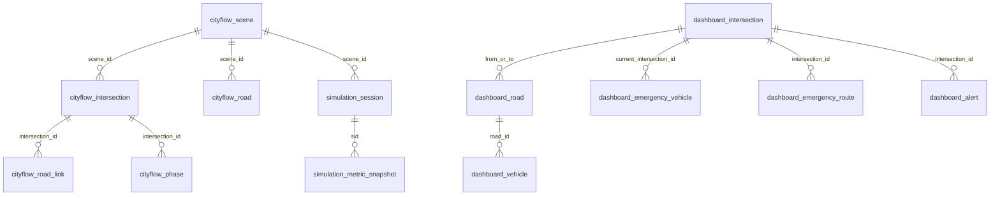

# 数据库结构说明

更新时间：2026-07-10

本文档整理当前项目代码中可确认的数据库结构，主要依据：

- `src/main/resources/db/migration/V1__init_core_tables.sql`
- `src/main/resources/db/migration/V2__seed_dashboard_demo_data.sql`
- `src/main/resources/db/migration/V3__seed_data_analysis_demo_data.sql`
- `src/main/resources/application.yml`
- 当前 `JdbcTemplate` Repository 中的实际读写 SQL

## 当前数据库模式

| 场景 | 数据库 | 建表方式 | 说明 |
| --- | --- | --- | --- |
| 默认本地启动 | H2 内存库 | Flyway 自动执行 `db/migration` | 用于本地快速验证，应用重启后数据丢失。 |
| `postgres` profile | PostgreSQL `traffic_signal` | Flyway 关闭，Hibernate 不建表 | 用于连接已有数据库，避免改动现有表结构。 |

注意：`postgres` profile 下 `spring.flyway.enabled=false`，`spring.jpa.hibernate.ddl-auto=none`。也就是说，本文档中的 Flyway 表结构代表项目内置初始化结构，不一定等同于本机已经存在的 PostgreSQL 真实结构。

## 表分组总览

| 模块 | 表 |
| --- | --- |
| CityFlow 静态路网 | `cityflow_scene`、`cityflow_intersection`、`cityflow_road`、`cityflow_road_link`、`cityflow_phase` |
| 仿真会话与指标 | `simulation_session`、`simulation_metric_snapshot` |
| 路口基础表 | `intersections` |
| 驾驶舱看板演示数据 | `dashboard_intersection`、`dashboard_road`、`dashboard_vehicle`、`dashboard_emergency_vehicle`、`dashboard_emergency_route`、`dashboard_alert`、`dashboard_statistics`、`dashboard_compare_metric`、`dashboard_congestion_trend`、`dashboard_assistant_reply` |
| 数据分析页演示数据 | `analytics_overview`、`analytics_metric`、`analytics_status_bucket`、`analytics_daily_point`、`analytics_hourly_point`、`analytics_building_summary`、`analytics_heatmap_cell`、`analytics_composition_item`、`analytics_scatter_point`、`analytics_monitoring_record`、`analytics_toast` |

## 逻辑关系

当前迁移脚本没有声明外键，表之间主要靠业务 ID 关联。

## CityFlow 静态路网

| 表 | 主键 | 字段概览 | 说明 |
| --- | --- | --- | --- |
| `cityflow_scene` | `id bigserial` | `scene_id varchar(64)`、`scene_name varchar(128)`、`roadnet_file_path varchar(512)`、`flow_file_path varchar(512)`、`description varchar(512)`、`created_at timestamp` | 仿真场景元数据。`scene_id` 唯一。 |
| `cityflow_intersection` | `id bigserial` | `scene_id varchar(64)`、`intersection_id varchar(128)`、`x double precision`、`y double precision`、`virtual boolean`、`controlled boolean` | 场景内路口节点。`scene_id + intersection_id` 唯一。 |
| `cityflow_road` | `id bigserial` | `scene_id varchar(64)`、`road_id varchar(128)`、`start_intersection_id varchar(128)`、`end_intersection_id varchar(128)`、`points_json text`、`lane_count integer`、`lane_width double precision`、`max_speed double precision` | 路段及几何信息。`scene_id + road_id` 唯一。 |
| `cityflow_road_link` | `id bigserial` | `scene_id varchar(64)`、`intersection_id varchar(128)`、`road_link_index integer`、`start_road_id varchar(128)`、`end_road_id varchar(128)`、`type varchar(64)`、`lane_links_json text` | 路口内转向连接。`scene_id + intersection_id + road_link_index` 唯一。 |
| `cityflow_phase` | `id bigserial` | `scene_id varchar(64)`、`intersection_id varchar(128)`、`phase_index integer`、`phase_code varchar(64)`、`duration integer`、`available_road_links_json text` | 路口信号相位。`scene_id + intersection_id + phase_index` 唯一。 |

## 仿真会话与指标

| 表 | 主键 | 字段概览 | 说明 |
| --- | --- | --- | --- |
| `simulation_session` | `id bigserial` | `sid varchar(64)`、`scene_id varchar(64)`、`controller_type varchar(64)`、`status varchar(32)`、`sim_time double precision`、`run_counts integer`、`step_interval double precision`、`decision_interval double precision`、`started_at timestamp`、`ended_at timestamp`、`created_at timestamp` | 一次仿真运行会话。`sid` 唯一。 |
| `simulation_metric_snapshot` | `id bigserial` | `sid varchar(64)`、`sim_time double precision`、`vehicle_count integer`、`queue_count integer`、`avg_speed double precision`、`avg_wait double precision`、`throughput integer`、`created_at timestamp` | 仿真指标快照。通过 `sid` 逻辑关联 `simulation_session`。 |

## 路口基础表

| 表 | 主键 | 字段概览 | 说明 |
| --- | --- | --- | --- |
| `intersections` | `id uuid` | `code varchar(32)`、`name varchar(128)`、`district varchar(64)`、`longitude decimal(10,6)`、`latitude decimal(10,6)`、`status varchar(32)`、`metadata text`、`created_at timestamp`、`updated_at timestamp` | 当前后端已打通读写闭环的路口基础表。`code` 唯一。 |

当前实际接口：

- `GET /api/v1/intersections` 读取全部路口。
- `GET /api/v1/intersections/{code}` 按 `code` 读取单个路口。
- `PATCH /api/v1/intersections/{code}/status` 更新 `status`。

## 驾驶舱看板演示数据

| 表 | 主键 | 字段概览 | 说明 |
| --- | --- | --- | --- |
| `dashboard_intersection` | `id varchar(32)` | `name`、`x`、`y`、`lng`、`lat`、`row_no`、`col_no`、`current_phase`、`green_remain`、`queue_length`、`average_delay`、`congestion_index`、`device_status` | 看板路口状态。 |
| `dashboard_road` | `id varchar(32)` | `from_intersection_id`、`to_intersection_id`、`name`、`flow`、`speed`、`queue_length`、`congestion_index`、`lane_count`、`direction`、`path_json` | 看板道路状态和绘制路径。 |
| `dashboard_vehicle` | `id varchar(32)` | `road_id`、`progress`、`speed`、`vehicle_type`、`lane_index` | 看板车辆点位。 |
| `dashboard_emergency_vehicle` | `id varchar(32)` | `vehicle_type`、`current_intersection_id`、`destination`、`green_wave_active`、`eta` | 应急车辆状态。 |
| `dashboard_emergency_route` | `sequence_no integer` | `intersection_id` | 应急绿波路线，按 `sequence_no` 排序。 |
| `dashboard_alert` | `id varchar(32)` | `type`、`level`、`title`、`location`、`event_time`、`intersection_id`、`acknowledged` | 看板告警列表。 |
| `dashboard_statistics` | `id integer` | `total_flow`、`average_speed`、`average_wait_time`、`congestion_index`、`congested_road_count`、`optimized_intersection_count`、`emergency_vehicle_count`、`device_online_rate`、`today_alert_count`、`green_wave_count` | 看板顶部统计卡片，目前查询固定 `id=1`。 |
| `dashboard_compare_metric` | `metric_key varchar(64)` | `name`、`traditional_value`、`ai_value`、`unit`、`direction` | 传统控制与 AI 控制对比指标。 |
| `dashboard_congestion_trend` | `sequence_no integer` | `time_label`、`metric_value` | 拥堵趋势折线图。 |
| `dashboard_assistant_reply` | `keyword varchar(32)` | `reply text` | 看板助手关键字回复。 |

## 数据分析页演示数据

| 表 | 主键 | 字段概览 | 说明 |
| --- | --- | --- | --- |
| `analytics_overview` | `id integer` | `sample_count`、`sample_rate`、`health_score`、`sampled_point_id` | 数据分析总览。当前查询固定 `id=1`。 |
| `analytics_metric` | `sequence_no integer` | `label`、`detail`、`tone`、`metric_value` | 指标卡片。 |
| `analytics_status_bucket` | `sequence_no integer` | `label`、`tone`、`bucket_count` | 状态分布。 |
| `analytics_daily_point` | `sequence_no integer` | `date_label`、`electricity`、`hvac`、`occupancy`、`water` | 日维度趋势。 |
| `analytics_hourly_point` | `sequence_no integer` | `hour_label`、`electricity`、`hvac`、`occupancy`、`temperature` | 小时维度趋势。 |
| `analytics_building_summary` | `sequence_no integer` | `building_id`、`building_type`、`average_occupancy`、`efficiency_score`、`electricity`、`hvac`、`status_label`、`warning_count`、`water` | 建筑汇总数据。 |
| `analytics_heatmap_cell` | `sequence_no integer` | `date_label`、`hour_label`、`electricity`、`intensity`、`occupancy` | 热力图单元格。 |
| `analytics_composition_item` | `sequence_no integer` | `label`、`color`、`item_value` | 构成占比。 |
| `analytics_scatter_point` | `sequence_no integer` | `point_id`、`building_id`、`hour_label`、`electricity`、`occupancy`、`temperature`、`tone` | 散点图数据。 |
| `analytics_monitoring_record` | `sequence_no integer` | `record_id`、`building_id`、`building_type`、`chilled_water_return_temp`、`chilled_water_supply_temp`、`device_id`、`device_status`、`electricity_kwh`、`env_humidity`、`env_temperature`、`hvac_kwh`、`monitor_time`、`occupancy_density`、`water_m3` | 监测明细表。 |
| `analytics_toast` | `sequence_no integer` | `toast_id`、`title`、`body`、`tone` | 页面提示消息。 |

注意：`analytics_*` 当前字段明显偏建筑能耗演示数据，不完全贴合交通信号控制业务。如果数据分析页后续要回归交通主题，建议重新设计为交通流量、排队、延误、通行效率、信号优化效果等指标表。

## 当前后端实际访问表

| 代码位置 | 表 |
| --- | --- |
| `IntersectionRepository` | `intersections` |
| `DashboardRepository` | `dashboard_intersection`、`dashboard_road`、`dashboard_vehicle`、`dashboard_emergency_vehicle`、`dashboard_emergency_route`、`dashboard_alert`、`dashboard_statistics`、`dashboard_compare_metric`、`dashboard_congestion_trend`、`dashboard_assistant_reply` |
| `DataAnalysisRepository` | `analytics_overview`、`analytics_metric`、`analytics_status_bucket`、`analytics_daily_point`、`analytics_hourly_point`、`analytics_building_summary`、`analytics_heatmap_cell`、`analytics_composition_item`、`analytics_scatter_point`、`analytics_monitoring_record`、`analytics_toast` |
| `DatabaseStatusService` | 检查 `intersections`、`lanes`、`traffic_snapshots`、`signal_plans`、`signal_phases`、`emergency_events`、`algorithm_runs` 是否存在并统计行数 |

## 需要特别注意

- Flyway 迁移脚本没有声明外键，删除或更新数据时要由业务层保证关联一致。
- `dashboard_*` 和 `analytics_*` 目前更像演示页种子数据表，不是严格的核心业务模型。
- `DatabaseStatusService` 中的 `lanes`、`traffic_snapshots`、`signal_plans`、`signal_phases`、`emergency_events`、`algorithm_runs` 未在当前 Flyway 脚本中定义；这些更像既有 PostgreSQL 数据库中的外部核心表。
- `intersections.id` 在迁移脚本中使用 `uuid default random_uuid()`，这适合 H2；如果未来让 PostgreSQL 执行该迁移，需要确认 UUID 默认函数是否改成 PostgreSQL 可用写法。
