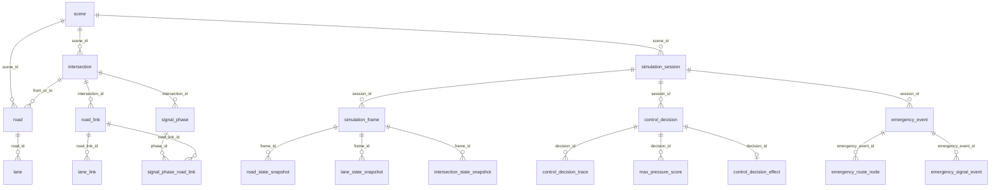

# 数据库结构说明

更新时间：2026-07-12

本文档根据 `backend/src/main/resources/db/migration`、当前后端读取表，以及后端同学提供的《Traffic-Signal-Database-Schema-Design.xlsx》整理。核心迁移脚本已经从旧的 `cityflow_*` 扁平表，调整为按业务实体拆分的标准结构。

## 当前数据库模式

| 场景 | 数据库 | 建表方式 | 说明 |
| --- | --- | --- | --- |
| 默认本地启动 | H2 内存库 | Flyway 自动执行 `db/migration/common` 与 `db/migration/h2` | 用于本地快速验证，应用重启后数据丢失。 |
| `postgres` profile | PostgreSQL `traffic_signal` | Flyway 由 `TRAFFIC_DB_FLYWAY_ENABLED` 控制，Hibernate 不建表 | 用于连接共享数据库并执行版本化增量迁移。 |

注意：`postgres` profile 中 `spring.jpa.hibernate.ddl-auto=none`，结构只由 Flyway migration 演进。共享 PostgreSQL 已建立 V5 baseline 并执行后续迁移，禁止使用 Hibernate 自动补表。

## 实施原则

- 标准核心表采用表格中的实体名称：`scene`、`intersection`、`road`、`lane`、`signal_phase`、`simulation_frame`、`control_decision` 等。
- `dashboard_*`、`analytics_*` 和现有接口使用的 `intersections` 表继续保留，避免影响当前前端页面和已经打通的路口 API。
- 表格中建议为 `jsonb` 或 `jsonb / geometry` 的字段，在当前 Flyway 脚本里使用 `text`，保证 H2 本地环境可以启动；真实 PostgreSQL 落库时可按需要升级为 `jsonb` 或 PostGIS `geometry`。
- 标准实体主键为 `uuid`，由业务代码生成，不在迁移脚本中绑定 H2 专有默认函数。
- 核心关系已声明外键和常用唯一约束，演示表仍保持原有轻量结构。

## 表分组总览

| 业务域 | 表 |
| --- | --- |
| 路网与地图绑定 | `scene`、`intersection`、`road`、`lane`、`road_link`、`lane_link` |
| 信号相位与安全约束 | `signal_phase`、`signal_phase_road_link`、`signal_timing_plan`、`signal_timing_plan_phase`、`safety_constraint`、`phase_transition_rule` |
| 仿真会话与状态快照 | `simulation_session`、`simulation_frame`、`road_state_snapshot`、`lane_state_snapshot`、`intersection_state_snapshot`、`vehicle_state_snapshot` |
| 策略调度与模型审计 | `control_decision`、`control_decision_trace`、`control_decision_effect`、`traffic_r_inference_log`、`max_pressure_score`、`strategy_fallback_event`、`safety_constraint_event` |
| 短时交通预测 | `traffic_forecast_observation`、`traffic_forecast_model_registry` |
| 区域、应急、Agent 与运维 | `control_region`、`control_region_intersection`、`emergency_event`、`emergency_route_node`、`emergency_signal_event`、`agent_conversation`、`agent_message`、`agent_tool_call`、`operation_audit_log`、`alert_event`、`service_health_snapshot` |
| 认证与账号 | `auth_user` |
| 当前保留的兼容/演示表 | `intersections`、`dashboard_*`、`analytics_*` |

## 逻辑关系

## 路网与地图绑定

| 表 | 主键/唯一约束 | 字段 |
| --- | --- | --- |
| `scene` | `id`; `scene_code` 唯一 | `scene_code`、`name`、`source_type`、`cityflow_roadnet_path`、`cityflow_flow_path`、`map_provider`、`coordinate_system` |
| `intersection` | `id`; `(scene_id, cityflow_id)` 唯一 | `scene_id`、`cityflow_id`、`map_intersection_id`、`name`、`type`、`virtual`、`longitude`、`latitude`、`x`、`y` |
| `road` | `id`; `(scene_id, cityflow_id)` 唯一 | `scene_id`、`cityflow_id`、`from_intersection_id`、`to_intersection_id`、`name`、`direction`、`length_m`、`speed_limit`、`lane_count`、`geometry` |
| `lane` | `id`; `(road_id, cityflow_lane_index)` 唯一 | `road_id`、`cityflow_lane_index`、`lane_code`、`direction`、`movement`、`width`、`speed_limit` |
| `road_link` | `id`; `(intersection_id, cityflow_index)` 唯一 | `intersection_id`、`cityflow_index`、`from_road_id`、`to_road_id`、`movement_type` |
| `lane_link` | `id`; `(road_link_id, start_lane_id, end_lane_id)` 唯一 | `road_link_id`、`start_lane_id`、`end_lane_id`、`geometry` |

## 信号相位与安全约束

| 表 | 主键/唯一约束 | 字段 |
| --- | --- | --- |
| `signal_phase` | `id`; `(intersection_id, phase_index)` 唯一 | `intersection_id`、`phase_index`、`phase_code`、`phase_name`、`phase_type`、`default_green_sec`、`yellow_sec`、`all_red_sec` |
| `signal_phase_road_link` | `(phase_id, road_link_id)` 复合主键 | `phase_id`、`road_link_id` |
| `signal_timing_plan` | `id`; `(intersection_id, plan_code)` 唯一 | `intersection_id`、`plan_code`、`name`、`source`、`cycle_sec`、`offset_sec`、`status` |
| `signal_timing_plan_phase` | `id`; `(plan_id, sequence_no)`、`(plan_id, phase_id)` 唯一 | `plan_id`、`phase_id`、`sequence_no`、`green_sec` |
| `safety_constraint` | `id` | `intersection_id`、`constraint_type`、`min_value`、`max_value`、`config_payload` |
| `phase_transition_rule` | `id`; `(intersection_id, from_phase_id, to_phase_id)` 唯一 | `intersection_id`、`from_phase_id`、`to_phase_id`、`allowed`、`transition_yellow_sec`、`transition_all_red_sec` |

## 仿真会话与状态快照

| 表 | 主键/唯一约束 | 字段 |
| --- | --- | --- |
| `simulation_session` | `id`; `sid` 唯一 | `sid`、`scene_id`、`controller_type`、`speed`、`status` |
| `simulation_frame` | `id`; `(session_id, seq)` 唯一 | `session_id`、`seq`、`sim_time`、`vehicle_count`、`queue_count`、`avg_speed`、`avg_wait`、`throughput` |
| `road_state_snapshot` | `id`; `(frame_id, road_id)` 唯一 | `frame_id`、`road_id`、`vehicle_count`、`queue_count`、`avg_speed`、`level` |
| `lane_state_snapshot` | `id`; `(frame_id, lane_id)` 唯一 | `frame_id`、`lane_id`、`queue_len`、`vehicle_count`、`avg_wait_time`、`cell_1`、`cell_2`、`cell_3`、`cell_4` |
| `intersection_state_snapshot` | `id`; `(frame_id, intersection_id)` 唯一 | `frame_id`、`intersection_id`、`queue_count`、`avg_wait`、`level`、`current_phase_id` |
| `intersection_movement_state_snapshot` | `id`; `(frame_id, intersection_id, movement_code)` 唯一 | `frame_id`、`intersection_id`、`movement_code`、`queue_len`、`vehicle_count`、`avg_wait_time`、`avg_speed`、`cell_1` 至 `cell_4` |
| `vehicle_state_snapshot` | `id`; `(frame_id, vehicle_id)` 唯一 | `frame_id`、`vehicle_id`、`road_id`、`lane_id`、`x`、`y`、`angle`、`speed`、`vehicle_type` |

## 策略调度与模型审计

| 表 | 主键/唯一约束 | 字段 |
| --- | --- | --- |
| `control_decision` | `id`; `decision_key` 唯一 | `input_frame_id`、`session_id`、`intersection_id`、`sim_time`、`controller_type`、`requested_phase_id`、`final_phase_id`、`duration_sec`、`status`、`reason`、`confidence`、`metadata` |
| `control_decision_trace` | `id` | `decision_id`、`stage`、`input_payload`、`output_payload`、`message` |
| `control_decision_effect` | `id`; `decision_id` 唯一 | `before_frame_id`、`after_frame_id`、`horizon_sec`、排队/等待/速度/通行量的 before、after、delta、`evaluation_label`、`detail_payload` |
| `traffic_r_inference_log` | `id` | `session_id`、`sim_time`、`request_payload`、`prompt_text`、`raw_output`、`parsed_phase_code`、`valid`、`latency_ms`、`error_message` |
| `max_pressure_score` | `id`; `(decision_id, phase_id)` 唯一 | `decision_id`、`phase_id`、`pressure_score`、`detail_payload` |
| `strategy_fallback_event` | `id` | `session_id`、`intersection_id`、`from_strategy`、`to_strategy`、`reason`、`sim_time` |
| `safety_constraint_event` | `id` | `decision_id`、`constraint_type`、`action`、`before_phase_id`、`after_phase_id`、`reason` |

## 区域、应急、Agent 与运维

| 表 | 主键/唯一约束 | 字段 |
| --- | --- | --- |
| `control_region` | `id`; `(scene_id, region_code)` 唯一 | `scene_id`、`region_code`、`name`、`controller_type`、`region_type` |
| `control_region_intersection` | `(region_id, intersection_id)` 复合主键 | `region_id`、`intersection_id`、`role` |
| `emergency_event` | `id`; `event_code` 唯一 | `session_id`、`event_code`、`vehicle_id`、`vehicle_type`、`priority`、`status`、`start_coord`、`end_coord` |
| `emergency_route_node` | `id`; `(emergency_event_id, sequence_no)` 唯一 | `emergency_event_id`、`sequence_no`、`intersection_id`、`road_id`、`planned_arrival_time`、`actual_arrival_time` |
| `emergency_signal_event` | `id` | `emergency_event_id`、`intersection_id`、`sim_time`、`action_type`、`phase_id_before`、`phase_id_after`、`reason` |
| `agent_conversation` | `id` | `user_id`、`session_id`、`title` |
| `agent_message` | `id` | `conversation_id`、`role`、`content` |
| `agent_tool_call` | `id` | `message_id`、`tool_name`、`arguments_payload`、`result_payload`、`status`、`latency_ms` |
| `operation_audit_log` | `id` | `actor_type`、`actor_id`、`operation_type`、`target_type`、`target_id`、`request_payload`、`result_status` |
| `alert_event` | `id` | `session_id`、`alert_type`、`level`、`target_type`、`target_id`、`title`、`description`、`status` |
| `service_health_snapshot` | `id` | `service_name`、`status`、`latency_ms`、`detail_payload`、`checked_at` |

## 认证与账号

`V6__auth_users.sql` 新增 `auth_user`，用于登录、注册、邮箱验证码登录后的账号查询。

| 表 | 主键/唯一约束 | 字段 |
| --- | --- | --- |
| `auth_user` | `id`; `normalized_username` 唯一；`normalized_email` 唯一 | `username`、`normalized_username`、`email`、`normalized_email`、`password_hash`、`role`、`enabled`、`created_at`、`updated_at` |

当前边界：

- 密码以 PBKDF2-SHA256 哈希保存到 `password_hash`。
- `AuthService` 在应用启动后根据 `auth.initial-account.*` 创建默认管理员账号；如果同名账号已存在则跳过。
- 当前返回的登录 `token` 是临时 UUID 标识，尚未作为数据库会话或 JWT 持久化。

## 保留表

### `intersections`

当前路口基础 API 仍读取和更新 `intersections` 表：

- `GET /api/v1/intersections`
- `GET /api/v1/intersections/{code}`
- `PATCH /api/v1/intersections/{code}/status`

字段保持不变：`id`、`code`、`name`、`district`、`longitude`、`latitude`、`status`、`metadata`、`created_at`、`updated_at`。后续如果要完全切到标准 `intersection` 表，需要同步改 Controller、Service、Repository、DTO 和前端调用。

### `dashboard_*`

`dashboard_intersection`、`dashboard_road`、`dashboard_vehicle`、`dashboard_emergency_vehicle`、`dashboard_emergency_route`、`dashboard_alert`、`dashboard_statistics`、`dashboard_compare_metric`、`dashboard_congestion_trend`、`dashboard_assistant_reply` 继续作为驾驶舱演示数据表保留。

### `analytics_*`

数据分析页使用数据库快照与顺序事件，不再由浏览器随机生成指标、消息或监测记录：

- `analytics_overview`、`analytics_metric`、`analytics_status_bucket`、`analytics_daily_point`、`analytics_hourly_point`、`analytics_building_summary`、`analytics_heatmap_cell`、`analytics_composition_item`、`analytics_scatter_point`、`analytics_monitoring_record`、`analytics_toast` 保存页面首次加载快照。
- `analytics_metric_trend_point` 保存五个指标卡的历史趋势点。
- `analytics_strategy_metric` 保存 FixedTime、MaxPressure、Traffic-R1 的策略效果对比数据。
- `analytics_stream_metadata` 保存数据集起始时间和前端轮询间隔。
- `analytics_live_update` 以 `sequence_no` 为游标保存逐条更新事件。每条事件包含 KPI、健康评分、状态分布、小时流量/排队、六类通行构成、路口监测记录及可选 toast；V8 初始化 10,000 条事件，V10 增加 `passed_vehicles` 记录本次通过车辆数。V11 将事件定义为 5 秒通行聚合，V12 将每条增量调整为 3-6 辆，V13 根据事件序号、到达流量、控制策略和拥堵状态生成稳定伪随机扰动，避免连续事件机械地增加同一个数。`cumulative_traffic` 严格等于初始累计量加截至当前事件的所有 `passed_vehicles`。监测状态由到达流量、排队长度和策略阈值联合生成：FixedTime 更容易形成长队列，MaxPressure 与 Traffic-R1 仅在更高压力下进入缓行或拥堵。

### 短时交通预测表

- `traffic_forecast_observation` 保存每个路口、每分钟的规范化训练观测：流入量、排队长度、平均等待、平均速度、饱和度、相位、控制策略和设备状态。主键包含 `observation_source`，允许同一分钟同时保留真实与合成记录；读取时按 `REAL`、`IMPORTED`、`SYNTHETIC` 顺序选择。
- `observation_source='SYNTHETIC'` 的数据只用于模型链路开发和回测，不得宣称为真实道路精度；真实采集统一写入 `REAL`，并通过 `quality_status` 标记质量。
- `traffic_forecast_model_registry` 保存训练数据范围、样本量、来源摘要、测试指标、模型制品位置和当前激活版本。模型权重不写入数据库或 Git。
- V14 只建立结构。合成训练集由 `cloud/traffic-forecast/seed_training_data.py` 显式生成，不在 Flyway 中批量写入，避免迁移被百万级数据拖慢。

V1-V7、V9-V13 放在 `db/migration/common`。V8 按数据库方言分别位于 `db/migration/postgresql` 和 `db/migration/h2`，两者建立相同业务结构和数据规模；PostgreSQL 使用标准集合生成，H2 使用 `SYSTEM_RANGE`。禁止改写已在共享 PostgreSQL 执行的迁移。

## 当前后端实际访问表

| 代码位置 | 表 |
| --- | --- |
| `IntersectionRepository` | `intersections` |
| `DashboardRepository` | `dashboard_intersection`、`dashboard_road`、`dashboard_vehicle`、`dashboard_emergency_vehicle`、`dashboard_emergency_route`、`dashboard_alert`、`dashboard_statistics`、`dashboard_compare_metric`、`dashboard_congestion_trend`、`dashboard_assistant_reply` |
| `DataAnalysisRepository` | 数据分析全部 `analytics_*` 快照表，以及 `analytics_metric_trend_point`、`analytics_strategy_metric`、`analytics_stream_metadata`、`analytics_live_update` 顺序事件表 |
| `TrafficForecastRepository` | 读取 `traffic_forecast_observation` 最近连续 30 分钟，真实记录优先于同时间合成记录 |
| `AuthUserRepository` | `auth_user` |
| `DatabaseStatusService` | 标准核心表、`intersections`、`dashboard_intersection`、`analytics_overview` |
| `RuntimePersistenceService` | 默认主链路写入 `scene`、`intersection`、`road`、`lane`、`road_link`、`signal_phase`、`signal_phase_road_link`、`simulation_session`、`control_decision`、`control_decision_trace`、`traffic_r_inference_log`、`traffic_r_inference_result`、`strategy_fallback_event`；保留显式写入 `simulation_frame` 和各类 snapshot 的能力，并记录决策输入帧，但不再默认持久化全量仿真帧和车辆/道路/路口快照 |
| `LiveSimulationStateService` | 不访问数据库；在内存中保存每个运行中 `sid` 的 roadnet 和最近 5 帧，用于 Agent 实时状态查询与诊断 |
| `RuntimeQueryService` | 只读查询历史/复盘数据：session/frame、路网、snapshot、`control_decision`、`control_decision_trace`、`control_decision_effect`、`max_pressure_score`、Traffic-R、fallback、安全和健康表；Agent 实时状态工具不再依赖这些表 |

## 后续注意事项

- 如果要让 PostgreSQL 自动执行这些迁移，需要先确认 `postgres` profile 的 Flyway 策略，并把 `text` 形式的 JSON/几何字段升级为真实 `jsonb` 或 PostGIS 类型。
- 当前标准表仅完成结构定义，业务读写仍主要集中在保留表和外部 CityFlow 服务；后续接入落库时需要新增 Repository/Service。
- `intersections` 与标准 `intersection` 暂时并存。前者服务当前 API，后者服务规范化路网模型。

## 2026-07-11 Runtime Persistence Update

第一阶段运行时落库已由 `RuntimePersistenceService` 接入仿真主链路。2026-07-12 起，默认数据边界调整为“实时状态进内存缓存，复盘事件进数据库”：

- 创建仿真时会尝试读取 CityFlow roadnet，并缓存 `scene`、`intersection`、`road`、`lane`、`road_link`、`signal_phase`、`signal_phase_road_link` 基础映射；同时写入 `LiveSimulationStateService` 作为实时工具使用的内存 roadnet。
- `simulation_session` 在创建仿真时写入，并在 `start`、`pause`、`stop`、自然结束时更新 `status`。
- 每帧不再默认写入 `simulation_frame`、`road_state_snapshot`、`intersection_movement_state_snapshot`、`intersection_state_snapshot`、`vehicle_state_snapshot`。最新帧、道路状态、路口 movement 和车辆位置保留在内存最近帧缓存中，供 Agent 实时工具读取。
- 控制策略输出仍写入 `control_decision` 和 `control_decision_trace`；Traffic-R 成功推理会从 `ControlDecision.metadata` 落入 `traffic_r_inference_log` 与 `traffic_r_inference_result`；Traffic-R fallback 到 Max-Pressure 时写入 `strategy_fallback_event`。
- 快照表仍保留在数据库结构中，用于后续显式采样、低频摘要或离线实验，不作为当前默认实时状态来源。

当前边界：

- `lane_state_snapshot`、`intersection_movement_state_snapshot`、`road_state_snapshot`、`intersection_state_snapshot`、`vehicle_state_snapshot` 仍保留给后续真实 CityFlow lane id 对齐、低频采样或离线实验；当前 Agent 实时状态以 `LiveSimulationStateService` 内存缓存为准。
- Traffic-R 失败请求的完整 prompt/request 尚未在 client 层带 `sid`，因此当前只能持久化成功决策与 fallback 事件；若要复盘失败推理，需要后续扩展 Traffic-R 请求上下文或异步调度审计表。

## 2026-07-11 Runtime Query / Agent Tool Update

后端保留 `RuntimeQueryService` 作为数据库历史/复盘查询层，同时新增 `LiveSimulationStateService` 作为 Agent 实时状态查询层。当前接口位于：

- `/api/v1/runtime/**`：前端、运维页或调试脚本使用。
- `/api/v1/agent/tools/get_current_simulation_state`、`get_intersection_detail`、`get_road_detail`：读取内存实时缓存。
- `/api/v1/agent/tools/**` 其他复盘/日志类工具：与 MCP 工具名保持一致，读取数据库历史记录。

已支持的查询能力：

| 工具名 | 主要读取表 | 说明 |
| --- | --- | --- |
| `get_current_simulation_state` | 内存 `LiveSimulationStateService` | 查询指定或最近运行中会话的最新帧、信号和会话状态。 |
| `get_intersection_detail` | 内存 `LiveSimulationStateService` | 查询路口基础信息、相位、roadLink 和最新 movement 状态。 |
| `get_road_detail` | 内存 `LiveSimulationStateService` | 查询道路基础信息、lane 列表和最新道路状态。 |
| `get_latest_control_decisions` | `control_decision`、`signal_phase`、`simulation_session`、`intersection` | 按会话、路口和条数限制查询最近控制决策。 |
| `get_decision_trace` | `control_decision`、`control_decision_trace` | 查询单条控制决策的阶段追踪。 |
| `get_system_health` | `simulation_session`、关键运行表、`service_health_snapshot` | 查询数据库视角健康摘要；不会主动探测外部服务。 |
| `get_model_inference_log` | `traffic_r_inference_log`、`traffic_r_inference_result` | 查询已落库的 Traffic-R 推理日志与逐路口结果。 |
| `get_fallback_events` | `strategy_fallback_event`、`simulation_session`、`intersection` | 查询策略 fallback 事件。 |
| `get_safety_events` | `safety_constraint_event`、`control_decision`、`signal_phase` | 查询安全约束修改、拒绝或回退事件。 |
| `get_alert_events` | `alert_event`、`simulation_session` | 查询系统告警。 |
| `get_emergency_events` | `emergency_event`、`simulation_session` | 查询应急事件主记录。 |

查询边界：

- 接口全部为只读，不触发 CityFlow 推进或信号控制。
- `limit` 默认 20，最大 100，避免 Agent 一次取回大量历史数据。
- 路口参数支持标准 UUID、CityFlow ID 和 `map_intersection_id`；道路参数支持标准 UUID 和 CityFlow ID。
- `/api/v1/agent/tools/**` 支持可选 `messageId`；传入后会把工具调用写入 `agent_tool_call`，不传时只查询数据。

Agent 自身数据接口已由 `AgentDataService` 接入：

| 接口能力 | 主要读取/写入表 | 说明 |
| --- | --- | --- |
| 创建/查询 Agent 会话 | `agent_conversation`、`simulation_session` | 支持关联业务 `sid` 和外部客户端会话标识 `external_session_id`；当前不再表示百炼平台 Agent 会话。 |
| 创建/查询 Agent 消息 | `agent_message`、`agent_conversation` | 保存 `user`、`assistant`、`tool` 等角色消息。 |
| 写入/查询工具调用审计 | `agent_tool_call`、`agent_message` | 保存工具名、参数、结果摘要、状态、耗时和错误。 |

## 2026-07-12 MaxPressure Analysis Schema

V7 保留已有 MaxPressure 分析数据所需的兼容结构：

- `control_decision.decision_key` 为非空唯一键；`input_frame_id` 指向产生决策的输入帧。
- `control_decision_effect` 保存已有决策的前后帧效果数据。
- `max_pressure_score` 和 `control_decision_trace` 可由只读查询层返回给 Agent。
- 运行时仅为普通控制决策生成随机 `decision_key` 并关联 `input_frame_id`，不再自动生成 MaxPressure 候选评分、细分轨迹或后续效果。
- 系统不再输出 MaxPressure JSONL 审计日志，也不再通过异步 CityFlow 回调更新这类审计证据。

Agent 仍可通过 `get_latest_control_decisions` 和 `get_decision_trace` 读取数据库中已经存在的分析数据。
